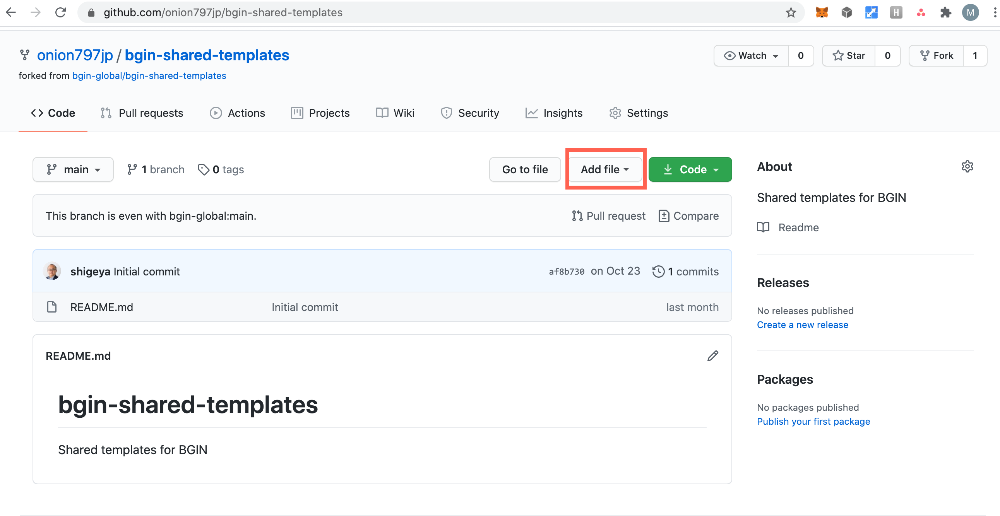
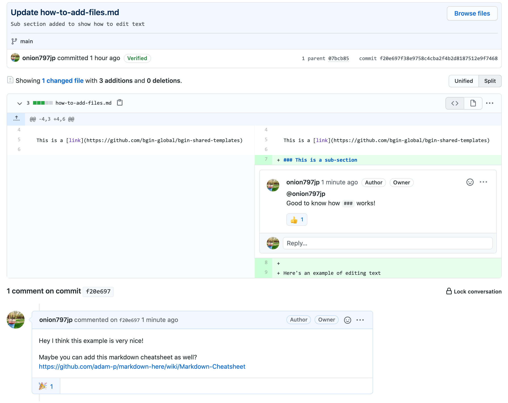

# This is title

## This is topic

This is a [link](https://github.com/bgin-global/bgin-shared-templates)

### This is a sub-section

Here's an example of editing text

# Step-by-step tutorial for GitHub beginners

## Table of Contents

1. Creating a new file 
2. Editing a file 
3. Making comments
4. Creating a new folder 
5. Uploading images

## 1. Go to a GitHub project and pick one repository

## 2. Fork the repository to make a copy in your repository

## 3. Create a new text file by clicking Add file button

## 4. Put a file name and make text contents with markdown language (easy)

## 5. Commit new file after you are satisfied with preview

## 6. Go to the directory to see your file

## 7. Click the file you want to edit

## 8. Click the editing button

## 9. Edit texts and commit changes

## 10. Commit history is available

## 11. Choose a commit and see diffs and add comments

## 12. You can also create a folder in the same way as `Add file`

### 13. Upload text files and images

### 14. Select `Pull requests` tab in your repository

### 15. Click `New pull request` button to go to the original repository

### 16. Now you can create pull request to the original repository

### 17. Write some comments and click `Create pull request`

- Optionally, you can make a draft pull request.
- You can stil make changes after creating pull request.
- Let's wait for comments or merged into their repository!

